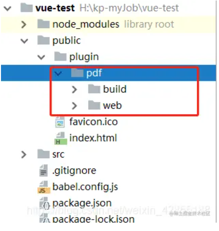

# 1、pdf预览

## 1、直接使用window.open

获取到pdf的预览地址后直接使用方法打开

```javascript
 let url = row.previewUrl;
  window.open(url);
```

##  2、使用pdf.js

**优点**：兼容性高，兼容ie10及以上、谷歌、安卓，苹果

**使用方法如下：**

（1）下载插件

下载路径：[GitHub下载地址](https://github.com/mozilla/pdf.js)

[百度网盘下载地址](https://pan.baidu.com/s/1z4_o8ahN3JNifSnALbKLeg)提取码7efu


（2）将下载构建后的插件放到文件中public



（3）代码

```javascript
<template>
  <el-drawer title="文档查看" :visible.sync="isShowPDF" direction="btt" size="98%" style="height: 1000px">
      <div class="wrap" style="height: 100%">
        <iframe :src="pSrc" width="100%" height="100%"></iframe>
      </div>
    </el-drawer>
<script>
  export default {
    name: "pdf",
    data() {
      return {pSrc: '',
               isShowPDF: false,
             };
    },
    methods: {
      loadPDF() {
        //baseurl ：pdf存放的文件路径，可以是本地的，也可以是远程，这个是远程的，亲测可以用
        // ie有缓存加个随机数解决
        let baseurl = 'http://storage.xuetangx.com/public_assets/xuetangx/PDF/PlayerAPI_v1.0.6.pdf';
        let pSrc = baseurl + '?r=' + new Date();
        this.pSrc = '../../plugin/pdf/web/viewer.html?file=' + encodeURIComponent(pSrc) + '.pdf';
      },
    },
    mounted: function () {
      this.loadPDF();
    }
  };
</script>
<style scoped>
  .wrap {
    position: fixed;
    top: 0;
    left: 0;
    width: 100%;
    bottom: 0;
  }
</style>
```

